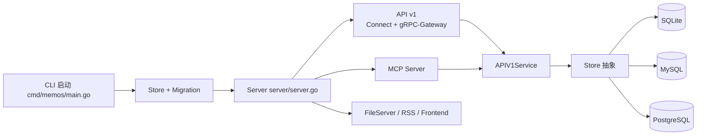

## TL;DR

1. `memos` 是单体 Go 后端，架构清晰，适合做“记忆底座”。
2. 协议层已支持 gRPC-Gateway + Connect + MCP，扩展面很好。
3. 业务核心集中在 `APIV1Service`，迁移或二次开发成本较低。
4. 当前没有 agent runtime/harness 编排层，需要你自行补齐。

## 1. 架构一图看懂

## 2. 分层与职责（可直接复用）

| 层 | 关键路径 | 职责 | 可借鉴点 |
|---|---|---|---|
| 启动层 | `cmd/memos/main.go` | 配置、建库、迁移、启动 | 启动时强制迁移，避免脏版本 |
| 服务层 | `server/server.go` | 路由装配、runner 管理 | 单入口统一注册，易观测 |
| 协议层 | `server/router/api/v1/v1.go` | Connect + Gateway | 多协议复用同一业务内核 |
| 业务层 | `APIV1Service` | memo/attachment/user/ai 逻辑 | 业务集中，协议薄适配 |
| 存储层 | `store/*` + `store/db/*` | 抽象 + 方言实现 | 多数据库同模型一致性 |
| AI 接口层 | `server/router/mcp/*` | MCP tools/resources/prompts | 给 AI 客户端暴露统一工具接口 |

## 3. 三条核心执行链路

### 3.1 启动链路

`main.go` -> `db.NewDBDriver` -> `store.New` -> `store.Migrate` -> `server.NewServer` -> `server.Start`

价值：
- 启动即校验 schema，避免运行期才暴雷。

### 3.2 API 链路（ListMemos）

`HTTP/Connect` -> `APIV1Service.ListMemos` -> `FindMemo` -> `Store.ListMemos` -> driver SQL

价值：
- 可见性与过滤在 service 层，数据库层保持纯数据访问。

### 3.3 MCP 链路（create/search）

`/mcp` -> `MCPService` -> `tools_*.go` -> `APIV1Service/Store` -> SSE/Webhook

价值：
- MCP 不重写业务，直接复用主链路，维护成本低。

## 4. 当前短板（实操视角）

1. 没有独立任务编排层（长耗时任务与在线请求未解耦）。
2. AI 能力目前窄，`AIService` 主要是转写。
3. 仍是单体，后续若上 skill marketplace 需要执行隔离层。

## 5. 改得更实用的建议（按优先级）

1. 新增 `application service` 层（把 APIV1Service 的复杂流程拆出去）。
2. 增加通用异步任务队列（embedding、摘要、清洗都走队列）。
3. 在 MCP 与业务层之间加 `policy + audit` 中间层。
4. 为关键链路补指标：QPS、P95、任务失败率、工具调用成本。

## 6. 快速体检清单

1. 是否有统一 trace-id 穿透 API/MCP/Store？
2. 是否有写路径幂等保障（重试不重复副作用）？
3. 是否把高耗时任务都移出同步请求？
4. 是否对 MCP mutation 建立了审计日志？

一句话：架构基础很扎实，离“可产品化 AI 后端”差的主要是执行编排层和可观测治理层。
