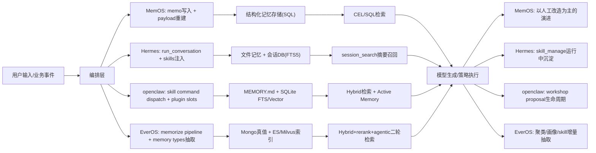

# 项目横向对比：记忆机制、Skill 执行机制与自我迭代/自我进化

更新时间：2026-04-25  
分析范围：`MemOS`、`Hermes`、`openclaw`、`EverOS`（基于仓库内研究文档横向归纳）

---

## 1. 分析口径与方法

为避免“同名不同义”，本文采用统一口径：

1. **记忆机制**：写入、存储、更新、检索、治理全链路。
2. **Skill 执行机制**：技能定义方式、触发入口、执行平面、安全与分发。
3. **自我迭代/自我进化**：系统是否能基于运行信号持续改进记忆与技能，而不只靠人工改代码。

---

## 2. 记忆机制：通性与差异

## 2.1 四个项目的记忆机制通性

1. **都把“记忆”从临时上下文中抽离为可持久化资产**  
   无论是 `memo`、`MEMORY.md`、`MemCell` 还是会话数据库，都不依赖单轮 prompt 存活。

2. **都存在“写入后可检索”的闭环**  
   写入路径和读取路径在架构中是成对出现的，不是单向日志系统。

3. **都在走“结构化增强”方向**  
   即使最轻量的实现也会做 tags/relations/metadata，而不是纯文本堆积。

4. **都开始重视治理与安全边界**  
   包括权限隔离、审计、删除/纠错、风险扫描、锁机制等。

## 2.2 关键差异（按能力层拆解）

| 维度 | MemOS | Hermes | openclaw | EverOS |
|---|---|---|---|---|
| 主记忆载体 | `memo` 表 + payload + relation | `MEMORY.md/USER.md` + session DB | `MEMORY.md` + dream/evidence 文件 + SQLite 索引 | Mongo 真值层（多类记忆文档） |
| 检索方式 | CEL->SQL（`LIKE/ILIKE`） | FTS5 + 会话摘要 | FTS5 + 向量 + hybrid merge | ES + Milvus + rerank + agentic 二轮检索 |
| 语义向量能力 | 原生缺失（需扩展） | 外部 provider 可扩展 | 内建支持（含降级策略） | 原生强（Milvus 为主） |
| 记忆分层成熟度 | 中低（内容记忆） | 中（文件记忆+会话记忆） | 中高（短期证据->长期晋升） | 高（episodic/fact/profile/agent_skill） |
| 增量更新机制 | 写入时重建 payload | `sync_turn/prefetch` 生命周期 | watch+debounce+interval + promotion 引擎 | 增量聚类、增量画像、增量 skill 抽取 |
| 一致性与并发策略 | 以业务写入一致性为主 | 文件锁 + 原子写 + DB 重试 | 锁+原子替换 reindex+fallback | Redis 分布式锁 + 幂等索引回写 |
| 多租户与产品化程度 | 业务权限隔离较好 | 面向 Agent 运行态 | 可多来源插件化，工程化强 | 企业级多租户骨架最完整 |

## 2.3 总体判断（记忆能力成熟度）

1. **MemOS**：最像“结构化内容记忆底座”，强在数据模型与 API 治理，弱在语义记忆闭环。  
2. **Hermes**：最像“Agent 工作记忆 + 会话召回系统”，强在运行期编排，弱在企业级存储分层。  
3. **openclaw**：最像“可进化记忆运行时”，强在晋升机制（Dreaming/Promotion）和在线检索工程。  
4. **EverOS**：最像“企业级长期记忆平台”，强在多记忆类型、双平面索引与增量流水线。

---

## 3. Skill 执行机制：异同点分析

## 3.1 Skill 执行机制通性

1. **都把 Skill 与工具调用关联起来**，不是纯文本模板。  
2. **都有某种入口触发机制**（命令、路由、网关方法或检索注入）。  
3. **都引入了安全/治理概念**，只是深度不同。  

## 3.2 Skill 执行机制核心差异

| 维度 | MemOS | Hermes | openclaw | EverOS |
|---|---|---|---|---|
| Skill 本体定义 | 以 MCP tools + prompts 为主 | `SKILL.md` 文档型技能 | Skill + command spec + plugin slot | `AgentSkill`（由案例抽取的 SOP 文本） |
| 触发方式 | MCP 调用 + prompt 引导 | `/skill-name` 注入 | `/skill` 后可 prompt 或直达 tool dispatch | 检索返回策略文本，不是独立执行包 |
| 是否有通用执行 runtime | 基本没有 | 以 Agent 主循环执行，非独立沙箱 runtime | 有较强运行时形态（plugin+gateway methods） | 没有完整可执行 skill runtime |
| 动态安装/更新 | 弱（主要后端内置） | 强（skills hub 多源安装） | 强（search/detail/install/update） | 弱（偏“抽取与检索”） |
| 技能自创建能力 | 基本无 | 有（`skill_manage` create/edit/patch） | 有（`skill-workshop` proposal lifecycle） | 有“抽取型增长”，无“执行型插件增长” |
| 安全链条 | 工具权限与只读控制 | 扫描+trust policy+quarantine | install scan + workshop scan + quarantine | 偏数据层与检索层治理，执行层待补 |

## 3.3 本质分型

1. **MemOS**：`Tool Governance` 型（工具治理型）。  
2. **Hermes**：`Prompt-Injected Skill` 型（提示注入型）。  
3. **openclaw**：`Runtime-Dispatch Skill` 型（运行时分发型）。  
4. **EverOS**：`Knowledge Skill` 型（知识/策略检索型）。  

---

## 4. 自我迭代与自我进化：异同点分析

这里把“进化”拆为三层：  
1) 记忆是否会自动沉淀升级；2) 技能是否会自动生成/改进；3) 平台是否具备治理闭环。

## 4.1 共性（四者都在做，但深度不同）

1. **都具备“运行数据->系统改进”的基础链路**。  
2. **都意识到要引入风险闸门**，不是让系统无限自写自跑。  
3. **都在朝 marketplace 或生态化扩展**，区别在于当前完成度。  

## 4.2 差异（自动化深度）

| 维度 | MemOS | Hermes | openclaw | EverOS |
|---|---|---|---|---|
| 记忆自进化 | payload 重建为主，偏结构化更新 | turn 级同步+会话检索摘要 | 短期证据评分晋升长期记忆 | 增量聚类+画像+skill 抽取+退役 |
| 技能自进化 | 基本无原生链路 | 运行期可 create/edit/patch skill | workshop 支持 pending/applied/rejected | 从 AgentCase 抽取 skill 文本并更新 |
| 自动晋升/退役机制 | 弱 | 中（可沉淀但规则较轻） | 强（阈值、权重、锁、marker） | 强（maturity_score + retire 机制） |
| 人工治理参与 | 主要靠开发者改造 | trust policy + 审核流程可接入 | 扫描+隔离+状态机，人工可控强 | 侧重企业治理（多租户、合规、审计） |
| 进化驱动信号 | 内容更新事件 | 对话执行与工具使用过程 | recall hit/查询多样性/阶段信号 | 新 MemCell、cluster 变化、画像更新时间 |

## 4.3 演化模式总结

1. **MemOS：工程化改造驱动**  
   进化主要来自“人为设计新子系统”，不是系统内生进化。

2. **Hermes：运行过程沉淀驱动**  
   借助 `skill_manage` 与会话召回，系统在使用中逐步积累能力。

3. **openclaw：机制化自进化驱动**  
   通过 promotion/scan/workshop 形成显式“提案->评估->生效”闭环。

4. **EverOS：数据流水线驱动**  
   依靠多层记忆抽取、聚类、画像、skill 增量更新形成平台级进化。

---

## 5. 三个主题的“通性与不同”一页结论

## 5.1 记忆机制

- **通性**：都已把记忆持久化并建立检索链路。  
- **不同**：从 `MemOS` 的结构化内容记忆，到 `openclaw/EverOS` 的语义+策略进化记忆，成熟度阶梯明显。

## 5.2 Skill 执行机制

- **通性**：都不是“纯提示词”，都试图将 skill 与可调用能力绑定。  
- **不同**：`MemOS` 偏工具集合，`Hermes` 偏注入式执行，`openclaw` 偏运行时分发，`EverOS` 偏策略知识化。

## 5.3 自我迭代/自我进化

- **通性**：都在构建“数据反馈->能力提升”闭环。  
- **不同**：自动化与治理深度依次大致为 `MemOS < Hermes < openclaw ~= EverOS`（但二者侧重点不同：openclaw 偏 runtime，EverOS 偏平台数据层）。

---

## 6. 对比结论（面向选型/组合）

1. 如果目标是**先稳住 C 端长期记忆后端**：优先借鉴 `MemOS` 数据模型与 `EverOS` 双平面检索。  
2. 如果目标是**快速做可执行 Skills 与安装分发**：优先借鉴 `Hermes + openclaw`。  
3. 如果目标是**系统自进化能力**：优先借鉴 `openclaw` 的 promotion/workshop 机制与 `EverOS` 的增量抽取流水线。  
4. 最可行组合不是“单仓照搬”，而是：  
   - 记忆底座：`MemOS/EverOS` 思路  
   - 执行运行时：`openclaw` 思路  
   - 技能治理与市场化：`Hermes/openclaw` 思路  

---

## 7. 四框架闭环图（Mermaid）

## 8. 落地映射矩阵（按你的目标拆分）

| 你的目标 | 优先借鉴框架 | 直接可用能力 | 需要补齐 |
|---|---|---|---|
| C 端长期记忆主库 | MemOS + EverOS | 结构化主表、双平面检索思路、增量更新流水线 | 向量化、事实冲突治理、删除权与审计 |
| 可执行 Skills（代码/搜索/文件/数据） | openclaw + Hermes | command dispatch、skills 注入、安装与管理 | 统一沙箱执行器、配额与审批网关 |
| Skills Marketplace | Hermes + openclaw | 多源检索/安装/更新、扫描与隔离、版本追踪 | 签名体系、评分排序、计费与结算 |
| 自我进化闭环 | openclaw + EverOS | promotion、提案状态机、增量抽取 | 统一质量信号、跨模块反馈控制器 |
| 企业级治理 | EverOS + Hermes | 多租户骨架、审计与策略分层 | 合规自动化（导出/删除/TTL）与成本治理 |

## 9. 建议的组合式路线（简版）

1. 第一步：用 `MemOS` 思路稳住结构化记忆底座（最快上线）。  
2. 第二步：引入 `openclaw` 的 dispatch + promotion，补“执行力+记忆进化力”。  
3. 第三步：引入 `Hermes` 的 skills hub/guard，补 marketplace 治理。  
4. 第四步：引入 `EverOS` 的双平面与增量流水线，做企业化规模扩展。  

---

## 10. 参考文档（本仓库内）

- `MemOS/02-记忆机制拆解与C端记忆后端改造方案.md`
- `MemOS/03-Skill执行机制与Marketplace改造方案.md`
- `MemOS/06-分阶段落地路线图与风险清单.md`
- `Hermes/02-记忆机制拆解与C端记忆后端改造方案.md`
- `Hermes/03-Skill执行机制与Marketplace改造方案.md`
- `Hermes/06-后端工程师落地TodoList（基于E2B与Hermes思路）.md`
- `openclaw/02-记忆机制拆解与C端记忆后端改造方案.md`
- `openclaw/03-Skill执行机制与Marketplace改造方案.md`
- `openclaw/06-分阶段落地路线图与风险清单.md`
- `EverOS/EverOS_Backend_Memory_Skill_Harness_Analysis.md`
